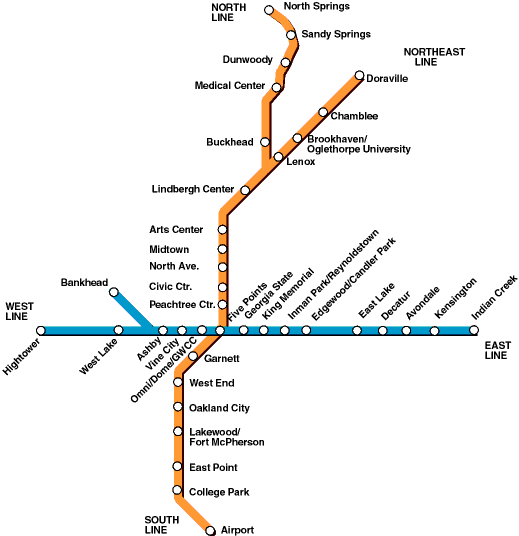

# Модульная контрольная работа по дисциплине Методы и системы искусственного интеллекта
## Выполнил Хитёв Владислав, cтудент группы ИС-41
## Вариант 21

Дано:
- Город Атланта (США).
- 2 ветки метро, по два разветвления в каждой.

Задача:
- Построить дерево поиска для заданной станции.
- Найти путь от станции А до станции Б.
- Реализовать BFS & DFS на Common Lisp & Prolog

Содержание репозитория:
- scripts - скрипты для создания, преобразования, вывода данных в подходящем для алгоритмов виде (граф представляется списком смежности).
- data - исходные и промежуточные данные
- results - результаты работы алгоритмов
- alg - реализации алгоритмов
